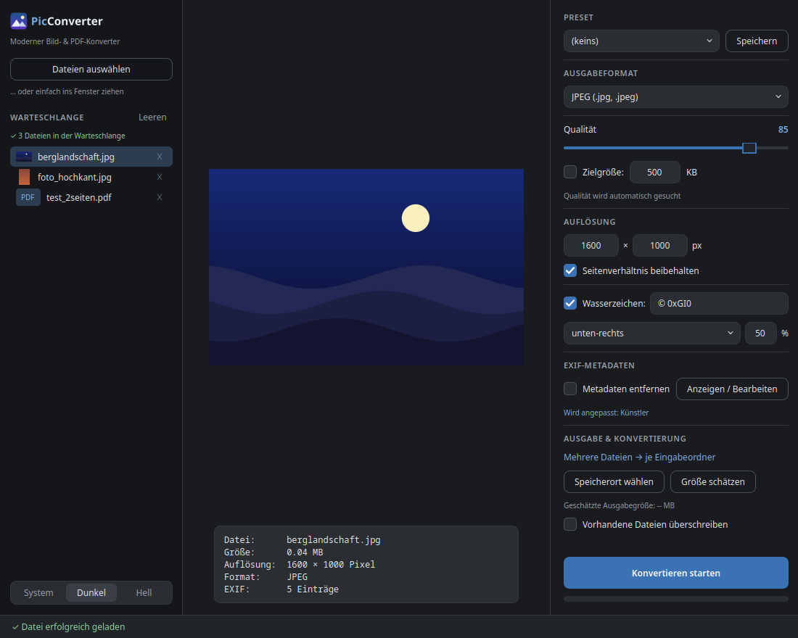
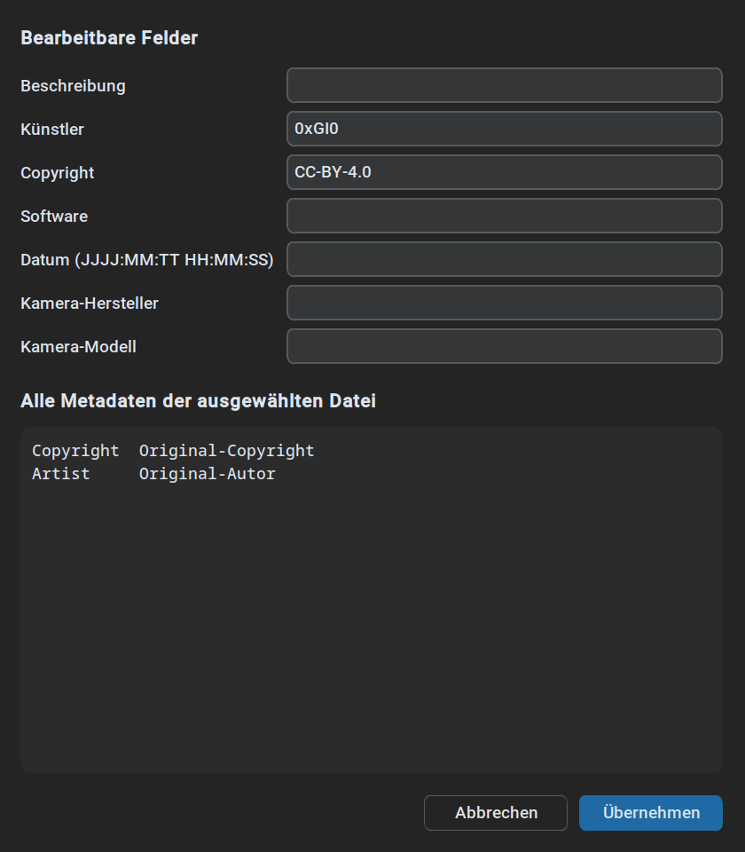

# 🖼️ PicConverter

[](https://www.python.org/)
[](https://github.com/0xGI0/PicConverter/actions/workflows/tests.yml)
[](https://github.com/TomSchimansky/CustomTkinter)
[](LICENSE)

🇩🇪 [Deutsche Version](README.md)

An **image & PDF conversion tool** for Python with a modern GUI (CustomTkinter) and a CLI for automation. Converts single files or whole batches between all common image formats and PDF — with EXIF management, watermarks, presets, target-size mode, and size estimation. The interface follows your system language (German/English).



<details>
<summary>📸 More screenshots</summary>

**EXIF editor** — view metadata, edit or delete fields:



</details>

---

## ✨ Features

- **All common image formats**: JPEG, PNG, BMP, TIFF, GIF, WebP, ICO — plus **HEIC/HEIF and AVIF** as input (iPhone photos)
- **PDF in both directions**: save images as PDF or export PDF pages as images (page selection, all pages, DPI choice)
- **Batch processing**: queue with mini previews in the GUI, globs like `*.jpg` and parallel processing in the CLI
- **Combined PDF**: merge multiple images (and PDF pages) into one multi-page PDF
- **EXIF metadata**: automatic correct image orientation; keep, strip, or edit metadata fields (artist, copyright, date, …)
- **Watermarks**: text or logo image, with position and opacity
- **Presets**: built-in (`web`, `email`, `archiv`) or save your own — in GUI and CLI
- **Target size instead of quality**: specify "max. 500 KB" — the matching quality is found automatically (JPEG/WebP)
- **Overwrite protection**: existing files are preserved, outputs fall back to `name (1).ext`
- **Animated GIFs/WebPs** keep their animation for GIF↔WebP
- **Adjustable quality/compression**, **resizing** with aspect-ratio preservation, and **size estimation** before converting
- **Modern interface**: follows the system theme (switchable), live preview, PDF page navigation, inline results with "open folder", settings persist between sessions
- **Bilingual**: German/English, follows the system language (`PICCONVERTER_LANG=de|en` to override)
- **Two modes**: GUI for interactive use, CLI for scripts and automation

---

## 🚀 Installation

**Pre-built binaries (no Python needed):** Windows `.exe` and Linux builds are attached to the [Releases](https://github.com/0xGI0/PicConverter/releases).

**From source:**

```bash
git clone https://github.com/0xGI0/PicConverter.git
cd PicConverter
pip install -r requirements.txt
```

This installs:

| Package | Purpose |
|---------|---------|
| `Pillow` | Image processing |
| `customtkinter` | Modern GUI |
| `tkinterdnd2` | Drag & drop (optional — the GUI works without it) |
| `PyMuPDF` | PDF → image (optional — image → PDF works without it) |
| `pillow-heif` | HEIC/HEIF input (optional) |

**Install as a package (optional):** afterwards the commands `picconverter` and `picconverter-gui` are available system-wide:

```bash
pip install .[all]        # or: pipx install .[all]
```

**Application menu entry (Linux, after package installation):**

```bash
cp picconverter.desktop ~/.local/share/applications/
mkdir -p ~/.local/share/icons/hicolor/512x512/apps
cp assets/icon.png ~/.local/share/icons/hicolor/512x512/apps/picconverter.png
```

**Note (Linux):** tkinter itself is installed via the package manager if missing:

```bash
sudo apt-get install python3-tk    # Ubuntu/Debian
sudo dnf install python3-tkinter   # Fedora/RHEL
sudo pacman -S tk                  # Arch Linux
```

---

## 💻 Usage

### 🎨 GUI

```bash
python picconverter_gui.py        # or: picconverter-gui
```

1. Drag images or PDFs into the window or load them via **"Select files"** — multiple files form a queue (with mini previews and ✕ to remove); for PDFs a **page navigation** appears
2. Optionally choose a **preset** or **save** the current settings as your own preset
3. Choose the **output format** (including PDF); with PDF as target, all inputs can be **merged into one PDF**
4. Adjust the **quality** — or set a **target size in KB** (JPEG/WebP)
5. Optionally add a **watermark** text with position and opacity, enter a new **resolution**, or use **"Estimate size"**
6. Optionally **strip EXIF metadata** or edit individual fields via **"View / edit"**
7. Hit **"Start conversion"** — results appear inline, **"📂 Open folder"** takes you to the files; existing files are never overwritten (can be toggled)

The switch in the top right corner toggles between **system**, **dark**, and **light** mode. All settings persist for the next start.

### ⌨️ CLI

```bash
python picconverter_cli.py <inputs...> -f <format> [options]
```

**Examples:**

```bash
# JPG to PNG
python picconverter_cli.py photo.jpg -f png

# Batch: all JPGs to WebP into an output directory
python picconverter_cli.py *.jpg -f webp -q 85 -o output/

# Compress to at most 500 KB (quality is found automatically)
python picconverter_cli.py photo.jpg -f jpg --target-size 500

# Export all pages of a PDF as PNG (300 DPI)
python picconverter_cli.py document.pdf -f png --page all --dpi 300

# Merge multiple scans into one multi-page PDF
python picconverter_cli.py scan1.png scan2.png -f pdf --merge -o document.pdf

# Strip or edit EXIF metadata
python picconverter_cli.py photo.jpg -f jpg --strip-exif
python picconverter_cli.py photo.jpg -f jpg --exif-set "Artist=Jane Doe" --exif-set Copyright=

# Apply a preset / save your own
python picconverter_cli.py photo.jpg --preset web
python picconverter_cli.py --save-preset small -f jpg -q 40 -w 1280

# Watermark (text or logo)
python picconverter_cli.py photo.jpg -f jpg --watermark-text "© 2026" --watermark-pos unten-links
python picconverter_cli.py photo.jpg -f png --watermark-image logo.png --watermark-opacity 30
```

**Options:**

| Option | Short | Description | Example |
|--------|-------|-------------|---------|
| `--format` | `-f` | Target format (required unless preset sets it) | `-f png` |
| `--output` | `-o` | Output file or directory | `-o image.jpg` |
| `--quality` | `-q` | Quality/compression | `-q 90` |
| `--target-size` | | Target size in KB (JPEG/WebP) | `--target-size 500` |
| `--width` | `-w` | Width in pixels¹ | `-w 1920` |
| `--height` | | Height in pixels¹ | `--height 1080` |
| `--page` | | PDF page or `all` (default: 1) | `--page all` |
| `--dpi` | | PDF render DPI (default: 150) | `--dpi 300` |
| `--merge` | | Everything into one PDF (`-f pdf` only) | `--merge` |
| `--strip-exif` | | Remove EXIF metadata | `--strip-exif` |
| `--exif-set` | | Set/delete an EXIF field | `--exif-set Artist=Me` |
| `--watermark-text` | | Text watermark | `--watermark-text "© 2026"` |
| `--watermark-image` | | Logo watermark | `--watermark-image logo.png` |
| `--watermark-pos` | | Position (default: unten-rechts) | `--watermark-pos mitte` |
| `--watermark-opacity` | | Opacity in % (default: 50) | `--watermark-opacity 30` |
| `--preset` | | Apply a preset | `--preset web` |
| `--save-preset` | | Save options as a preset | `--save-preset small` |
| `--overwrite` | | Replace existing files | `--overwrite` |
| `--jobs` | | Parallel conversions | `--jobs 8` |
| `--estimate` | | Estimate size only | `--estimate` |
| `--quiet` | | Only print errors | `--quiet` |
| `--version` | | Show the version | `--version` |

¹ If only one dimension is given, the other is derived preserving the aspect ratio.
**Note:** `-h` is reserved for `--help`, hence `--height` for the height.

**EXIF fields for `--exif-set`:** `ImageDescription`, `Artist`, `Copyright`, `Software`, `DateTime`, `Make`, `Model` — an empty value (`--exif-set Copyright=`) deletes the field.
**Watermark positions:** `unten-rechts`, `unten-links`, `oben-rechts`, `oben-links`, `mitte` (bottom right/left, top right/left, center).

---

## 📊 Supported formats

| Format | Input | Output | Quality setting | Range |
|--------|-------|--------|-----------------|-------|
| **JPEG** | ✅ | ✅ | Quality | 1–100 |
| **PNG** | ✅ | ✅ | Compression | 0–9 |
| **WebP** | ✅ | ✅ | Quality | 0–100 |
| **BMP** | ✅ | ✅ | – | – |
| **TIFF** | ✅ | ✅ | Compression | 0–9 |
| **GIF** | ✅ | ✅ | – | – |
| **ICO** | ✅ | ✅ | – | – |
| **PDF** | ✅ (requires PyMuPDF) | ✅ | – | – |
| **HEIC/HEIF** | ✅ (requires pillow-heif) | – | – | – |
| **AVIF** | ✅ (Pillow ≥ 11) | – | – | – |

- **JPEG/WebP**: higher values = better quality (default: 85 / 80)
- **PNG**: lower values = better quality (default: 6)
- **TIFF**: LZW compression is applied automatically
- **Transparency**: JPEG, BMP, and PDF do not support transparency — it is automatically replaced with white
- **EXIF**: carried over to JPEG, PNG, WebP, and TIFF; the orientation tag is applied on load so portrait photos stay upright
- **Animation**: GIF↔WebP keeps all frames; other target formats use the first frame (with a notice)

---

## 🛠️ Technical details

| Component | Details |
|-----------|---------|
| **Python version** | 3.9+ |
| **Architecture** | `picconverter_core` (shared logic) + CLI + GUI + `picconverter_i18n` |
| **Image processing** | Pillow (PIL) |
| **PDF rendering** | PyMuPDF (optional, PDF → image only) |
| **HEIC/HEIF** | pillow-heif (optional) |
| **GUI framework** | CustomTkinter |
| **Drag & drop** | tkinterdnd2 (optional) |
| **Configuration** | `~/.config/picconverter/` (presets, GUI settings) |
| **Tests & lint** | pytest + ruff, CI via GitHub Actions |
| **Releases** | PyInstaller binaries (Windows/Linux) per git tag |

---

## 🐛 Troubleshooting

**`ModuleNotFoundError: No module named 'customtkinter'` (or `'PIL'`)**

```bash
pip install -r requirements.txt
```

**"ImageTk could not be imported"**

```bash
sudo apt-get install python3-tk   # Ubuntu/Debian
sudo dnf install python3-tkinter  # Fedora/RHEL
# or: pip install --ignore-installed Pillow
```

**GUI too small or too large (HiDPI)**

On Linux the scaling is detected from the system DPI. If the result is off, set the factor manually:

```bash
PICCONVERTER_SCALE=1.5 python picconverter_gui.py
```

**Drag & drop does not work**

The GUI works without it — install `tkinterdnd2` for drag & drop:

```bash
pip install tkinterdnd2
```

**"PDF input requires PyMuPDF"**

PDF → image needs the PDF renderer PyMuPDF (image → PDF works without it):

```bash
pip install pymupdf
```

**HEIC files are not recognized**

```bash
pip install pillow-heif
```

**Wrong language**

The interface follows the system language; force it with:

```bash
PICCONVERTER_LANG=en picconverter-gui   # or =de
```

---

## 🤝 Contributing

Contributions are welcome! Fork the repository, create a feature branch, and open a pull request. Run the tests with `pytest tests/`, the linter with `ruff check .`.

**Feature ideas:** SVG input, password-protected PDFs, conversion history, more languages

---

## 📄 License

This project is licensed under the [MIT License](LICENSE).
